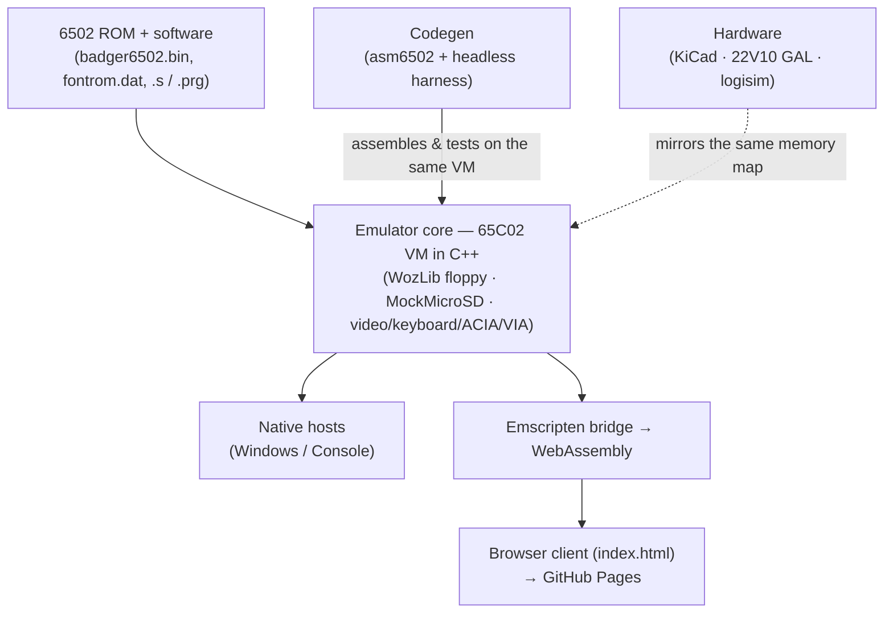

<h1 align="center">3ric</h1>

<p align="center">
  <strong>A from-scratch, Apple-II-class 65C02 personal computer — real hardware plus a
  cycle-honest emulator that also runs in your browser.</strong>
</p>

<p align="center">
  <a href="https://ebadger.github.io/3ric/"></a>
  <a href="https://www.youtube.com/playlist?list=PLbYLt1iawSBLK4w46Kn7cxxuoeVt7Zepq"></a>
  
  
  <a href="LICENSE"></a>
  <a href="LICENSE-CC-BY-SA-4.0.txt"></a>
</p>

---

## ▶ Try it now — no install, no account

**<https://ebadger.github.io/3ric/>** runs the *entire machine* client-side via
WebAssembly. Click the canvas and start typing at the monitor `*` prompt. Then:

- **Boot Disk** — boot the demo 5.25″ floppy (a self-booting machine-code disk).
- **Mount SD** — mount the micro-SD card and use the ROM's DOS shell (`DIR`, etc.).
- **Assemble & Run** — open the built-in 65C02 editor, write assembly, and run it like
  `BRUN` — all in the browser. Programs are shareable via a `?src=` deep link.

<!-- TODO(media): drop an animated GIF of the emulator booting + a program running here,
     e.g. . Keep it < ~5 MB for fast README loads. -->

## What is 3ric?

3ric is a personal *learn-by-building* project: an 8-bit computer designed at the chip level
— KiCad schematics, a custom PCB, and 22V10 GAL address-decode logic — paired with a C++
emulator of the exact same machine. The emulator compiles to WebAssembly, so the **same VM
core** that models the real hardware also boots the unmodified 512 KB ROM in any browser.
The whole journey is documented in a [YouTube build series][youtube].

> **Why it exists:** to understand, build, document, and demonstrate how an Apple-II-class
> computer works end to end — and to let anyone poke at it with zero friction. See
> [`docs/MISSION.md`](docs/MISSION.md).

## Features

- **65C02 CPU** with a faithful memory map and soft switches, adjustable clock speed.
- **Video**: 40×24 text, lo-res, and hi-res color, rendered to a canvas.
- **Input & I/O**: keyboard (`$C000`/`$C010`), 6551-style ACIA serial, 6522 VIA.
- **Disk II 5.25″ floppy** via `.woz` images (self-booting machine-code disks).
- **Micro-SD storage**: a bit-banged SPI FAT32 card with a ROM DOS shell.
- **In-browser 65C02 assembler/editor** — assemble & run, download a `.PRG`, share `?src=`
  links; ships ~11 sample programs.
- **AI-generated 6502 games** (Snake, Life, Minesweeper, 2048, Star Swarm, and more) built
  through the project's own codegen pipeline — see [`emulator/AICodeGen/`](emulator/AICodeGen/).
- **Runs everywhere the same way**: one shared C++ VM core drives both the native Windows
  build and the browser (WebAssembly) build.

## Write your first program in the browser

1. Open the [live emulator][demo] and pick a sample from the editor's program menu.
2. Edit the assembly, hit **Assemble & Run**, and watch it execute on the machine.
3. Use **Download .PRG** to save it, or copy the `?src=` link to share the exact program.

Prebuilt samples live in [`web/programs/`](web/programs/); their source and design notes
are under [`emulator/AICodeGen/`](emulator/AICodeGen/) and [`codegen/`](codegen/).

## Build from source

Full, current instructions are in [`status/SYSTEM-STATUS.md`](status/SYSTEM-STATUS.md).

**Native emulator (Windows):** open `emulator/Badger6502VM.sln` in Visual Studio 2022 and
build/run the `Console` or WinUI (`Badger6502Emulator`) host.

**Browser / WebAssembly build** (emsdk 6.0.1, Node, Python 3):

```powershell
pwsh web/build.ps1     # Emscripten -> web/badger6502.js + .wasm, stages data/
pwsh web/serve.ps1     # serves http://localhost:8011/index.html
```

**Verify it's healthy** (headless smoke tests — no WASM build needed for the first one):

```powershell
$node = "C:\Users\ebadger\emsdk\node\22.16.0_64bit\bin\node.exe"
& $node codegen/tools/asm6502.test.mjs   # assembler encoding tests
& $node web/test_boot.cjs                # ROM boots to a sane state
```

## How it works



The **memory map is a shared contract**: `emulator/Badger6502VMLib/vm.h` is mirrored by the
22V10 GAL decode, the web bridge, and the codegen platform reference. The architecture and
each layer are documented in [`specs/`](specs/) — start with
[`specs/SYSTEM.md`](specs/SYSTEM.md).

## Repository layout

| Path | What's there |
|------|--------------|
| [`emulator/`](emulator/) | C++ 65C02 VM core, WozLib, MockMicroSD, native hosts, ROM data, AI codegen programs |
| [`web/`](web/) | Emscripten bridge, browser client, in-browser assembler, Pages build/deploy |
| [`codegen/`](codegen/) | `asm6502` assembler, `run6502`/harness, platform-ref generation |
| [`specs/`](specs/) | Layer specifications (the source of truth — specs before code) |
| [`status/`](status/) | How to build/run/verify; current state and known gaps |
| [`docs/`](docs/) | Mission, workflow rules & learnings, roles |
| [`kicad/`](kicad/), [`22v10/`](22v10/), [`logisim/`](logisim/), [`diylayout/`](diylayout/), [`schematic_pdf/`](schematic_pdf/) | Hardware: schematics, PCB, GAL address decode, digital-logic models |
| [`romgen/`](romgen/), [`scripts/`](scripts/), [`test/`](test/) | ROM assembly tooling, dev/CI scripts, tests |

## Known gaps

- **DOS 3.3 / Applesoft disks don't run.** This clone's `$E000` BASIC is generic Microsoft
  BASIC, not Applesoft, so games that chain through an Applesoft auto-run greeting won't
  boot. Self-booting machine-code disks work.
- **Hardware is in progress** — schematics, PCB, and the 22V10 GAL logic are being built and
  documented in the video series; the emulator is the reference implementation.

## Contributing

Contributions and experiments are welcome — especially new 6502 programs for the gallery.

**Add a program (the easy path).** No C++, no local build: have an AI coding tool write a
65C02 program by pointing it at [`llms.txt`](https://ebadger.github.io/3ric/llms.txt), test it
in the [browser editor][demo], and open a one-file pull request to the
[Community Gallery](https://ebadger.github.io/3ric/gallery.html). Step-by-step, with a
copy-paste prompt: **[`CONTRIBUTING.md`](CONTRIBUTING.md)**.

**Change the machine itself.** A few house rules keep it trustworthy:

- **Specs before code.** Update the relevant spec in [`specs/`](specs/) in the same change.
- **Trace every layer** a change touches (ROM/software → C++ VM core → web bridge/WASM), and
  keep the **native and browser builds behavior-identical**.
- **Open a PR** — changes land via pull request, not direct pushes to `main`.

The full workflow rules live in [`docs/LEARNINGS.md`](docs/LEARNINGS.md); bug reports use the
templates under [`.github/ISSUE_TEMPLATE/`](.github/ISSUE_TEMPLATE/).

## The build series

3ric is built in public. Watch the design and construction, episode by episode:
**[YouTube build series][youtube]**.

## Support

If this project helps you learn or you just enjoy the build, you can support it via the
**Sponsor** button on this repository (see [`.github/FUNDING.yml`](.github/FUNDING.yml)).
Sponsorship funds parts, boards, and more build videos.

## License

3ric is **dual-licensed**:

- **Software** — [MIT](LICENSE).
- **Hardware designs & documentation** — [Creative Commons Attribution-ShareAlike 4.0
  International](LICENSE-CC-BY-SA-4.0.txt).

Bundled third-party components keep their own licenses, and some bundled data (the ROM's
Microsoft BASIC, Apple II disk images used as test fixtures) is third-party copyrighted
material **not** licensed by this project. See [`NOTICE`](NOTICE) for the full breakdown
before redistributing.

[demo]: https://ebadger.github.io/3ric/
[youtube]: https://www.youtube.com/playlist?list=PLbYLt1iawSBLK4w46Kn7cxxuoeVt7Zepq
