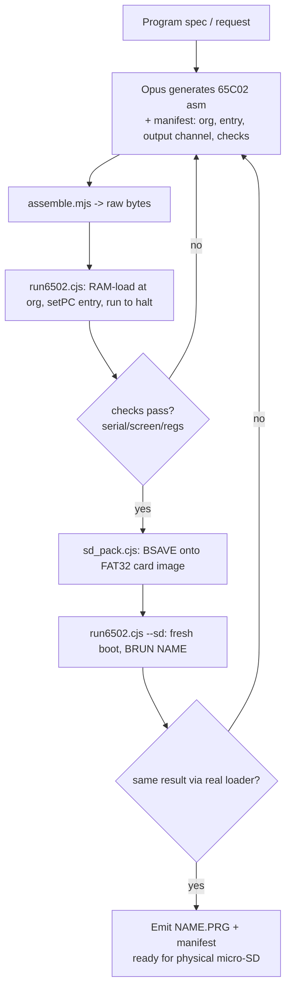

# Spec: AI (Opus) code generation for the 3ric computer, validated in the emulator and portable to physical hardware

## 1. Goal

Build a mechanism where a large language model (Opus) generates programs for the
**3ric** 65C02 computer, runs and iterates on them against the existing
WebAssembly emulator **headlessly**, and produces a **`.PRG` file that can be
copied onto a physical micro-SD card and `BRUN`/`BLOAD`ed on the real hardware**
with no changes.

The physical-portability requirement is the design driver. It is satisfied
"for free" because of one key fact:

> **The emulator runs the byte-for-byte identical ROM and FAT32 loader as the
> physical board.** `emulator/Data/badger6502.bin` is the same 512 KB ROM image
> that is burned to the machine, and the disk/SD paths (`fat32_*`,
> `cmd_bload`/`cmd_brun`/`cmd_bsave`) are the ROM's own code. So a program that
> boots from the emulated SD card via `BRUN` will boot from a real SD card via
> `BRUN`.

This means our validation strategy is not "emulate something close to the
hardware" — it is "drive the real ROM's real loader against a real FAT32 image,
in a headless harness."

## 2. Background: what the platform already gives us

### 2.1 Headless, scriptable emulator

`web/web_bridge.cpp` compiles the C++ VM core to WebAssembly and exposes a
`WebVM` class (Emscripten embind). It already runs under Node (see
`web/test_*.cjs`). The relevant API surface:

| Method | Purpose |
| --- | --- |
| `loadData(addr, Uint8Array)` | Bulk-load bytes into memory (used for the ROM and for a program blob) |
| `seedBasicRom()`, `loadFont(bytes)`, `loadSD(bytes)` | Standard boot setup + attach the FAT32 SD sparse image |
| `reset()` | Load PC from the reset vector `$FFFC` |
| `run(maxSteps)` | Cooperatively step the CPU (never uses the blocking `VM::Run`) |
| `step()` / breakpoint methods | Execute exactly one instruction or stop `run*` before a configured PC (browser debugger) |
| `setPC(addr)` | Jump directly to an address (for RAM-loaded test runs) |
| `poke(addr,v)` / `peek(addr)` | Byte access to the bus |
| `keyDown(code)` | Memory-mapped `$C000` keyboard strobe (drives the DOS shell) |
| `drainOutput()` | Returns serial-console bytes emitted by the program (ACIA `$C100`) |
| `pc/sp/regA/regX/regY/status` | CPU register + flags inspection |
| `renderFrame()` → RGBA | Full framebuffer (320×384) for graphics programs |
| `sdReadCount()` | Number of SD sector reads (proves the loader touched the card) |

### 2.2 Memory map (from `emulator/Badger6502VMLib/vm.h`)

```
$0000-$8FFF  RAM
$0400-$07FF  text / lo-res video page 1 (page 2 at $0800-$0BFF)
$2000-$5FFF  hi-res video (page 1 $2000, page 2 $4000)
$9000-$BFFF  BASIC ROM (generic Microsoft BASIC, not Applesoft)
$C000        keyboard data (bit7 = strobe)
$C010        keyboard strobe clear
$C030        system speaker toggle (any read or write access)
$C050-$C057  display soft switches (gfx/text, page, mixed, lo/hi-res)
$C0E0-$C0EF  Disk II
$C100-$C10F  ACIA (6551) serial  <-- writing the data reg emits a byte to drainOutput()
$C200-$C20F  VIA1 (bit-banged SPI micro-SD lives here)
$C300-$C30F  ROM disk / char-gen control
$C400-$C4FF  slot-4 dual-AY Mockingboard audio
$C600-$C6FF  Disk II boot PROM
$C800-$CFFF  RAM2
$D000-$FFFF  ROM / monitor / OS / DOS shell
```

### 2.3 ROM entry points (from `emulator/Data/badger6502.dbg`, a ca65 debug file)

The ROM is Apple-II-monitor compatible and was built with **cc65/ca65**. Named
routines a generated program can call:

| Symbol | Addr | Purpose |
| --- | --- | --- |
| `COUT` | `$FDED` | Output the char in A to the console (routes to the ACIA → `drainOutput()`) |
| `COUT1` | `$FDF0` | COUT without the output-vector indirection |
| `CROUT` | `$FD8E` | Output a carriage return |
| `PRBYTE` | `$FDDA` | Print A as two hex digits |
| `HOME` | `$FC58` | Clear the text screen, home the cursor |
| `CLRSCR` | `$F832` | Clear screen |
| `KEYIN` | `$FD1B` / `GETLNZ` `$FD67` | Keyboard input |
| `print_hex` | `$F070`, `print_hex_word` `$F04F`, `print_crlf` `$F03F`, `print_char` `$F00F` | Custom ROM print helpers |
| DOS shell | `$EC5C` (`dos`) | Mounts the SD (`fat32_start`) and shows the `>` prompt |
| `cmd_bsave` `$ACFD`, `cmd_bload` `$EE4F`, `cmd_brun` `$EE55`, `cmd_dir` `$D61B`, `cmd_cat` `$D5F5`, `cmd_chdir` `$ED5F`, `cmd_del` `$ED83` | DOS shell verbs |
| `fat32_file_write` `$EAC8`, `fat32_file_read` `$EA6A` | FAT32 read/write primitives |

A machine-readable copy of these tables is generated by
`codegen/tools/gen_platform_ref.mjs` (see §7) so the model prompt always matches
the ROM actually in the repo.

### 2.4 The `.PRG` on-disk format (reverse-engineered from the shipped SD image)

The SD image (`emulator/Data/sd.zip` → 2 GB FAT32) contains many real programs.
Findings from dumping actual files:

- **No DOS-3.3-style 4-byte header.** A `.PRG` is a **raw memory image**: byte 0
  of the file is the byte that lands at the load address.
  - `loderun.bin` (47104 B) begins `4C 00 60` = `JMP $6000`, loaded at `$0800`.
  - `ARC800.PRG` begins `05 4C 04 08 …` (`$0801: JMP $0804`), loaded at `$0800`.
- **The load address is supplied out-of-band, not stored in the file.** The
  fleet naming convention encodes it: `ARC800`/`FAT800`/`ALI800` → `$0800`,
  `ALI300`/`DK300` → `$0300`, `ARK1000` → `$1000`, `BB801`/`DNG801` → `$0801`.
- **BASIC `.PRG`s are raw `$0801` tokenized images.** `INTBD100.PRG` begins
  `18 08 64 00 BA …` = the Microsoft-BASIC line-link/line-number/token layout
  starting at `$0801` (`line 100: MAXFILES 1`).

Consequence for us: the artifact we hand the user is simply **the assembled raw
bytes**, named `NAME.PRG`, together with a documented **load address**. Nothing
else is needed to make it physically portable.

**Confirmed loader usage (from the machine owner):**

```
BRUN file.prg 4000
```

`BRUN <file> <hexaddr>` loads the raw image into RAM at `<hexaddr>` and then
**jumps to that same address**. So for a machine-code `.PRG`:

- The **load address and the entry address are identical** — the first byte of
  the file must be executable code (or a jump to it) at the chosen address.
- The load address is a **command argument**, not part of the file and not
  actually required to match the filename (the `…800`/`…300` naming is a human
  mnemonic for "what address to pass to `BRUN`").

The generated program therefore just needs to be assembled at a chosen ORG and
be entered at that ORG; the manifest records that ORG as the `BRUN` address.
(The exact `BSAVE` argument form used to *write* a file from the shell is still
confirmed empirically in Phase 0 (§10); `BRUN` itself is settled.)

### 2.5 Browser debugger metadata

The dependency-free assembler's result includes a `listing` record for each statement that
emits bytes:

```js
{ pc: 0x0800, bytes: [0xA9, 0x01], line: 12, kind: "instruction" }
```

`line` is one-based and `kind` is either `instruction` or `data`. This is additive to the
existing `org`, `bytes`, and `symbols` result, remains browser-safe, and is the authoritative
map used by 3RIC Studio for source breakpoints and current-PC highlighting. Directives are
shown for context but are not offered as executable breakpoints.

The browser's WebVM wrapper keeps breakpoint tests inside its C++ instruction loops and
exposes a one-instruction `step()` operation. This preserves normal execution throughput
while allowing exact pre-instruction stops. Separately, the web build stages the existing
ca65 `emulator/Data/badger6502.dbg`; a dependency-free browser parser can map ROM PCs to
symbols and source filename/line coordinates. The corresponding ROM source text is not
present in this repository and is therefore not part of the browser payload.

## 3. How the physical-SD requirement changes the original plan

The original idea was: generate asm → `loadData` into RAM → `setPC` → `run` →
inspect. That validates the *code* but bypasses the *loader*, so it would not
guarantee the program runs from a real SD card.

The revised plan adds a **round-trip through the real ROM loader** as the
authoritative acceptance test, and makes the deliverable a card-ready file:

1. Keep the fast "RAM load + `setPC`" path for **inner-loop iteration** (quick,
   no FAT32 involved).
2. Add an **SD round-trip path** for **final acceptance**: put the file on the
   emulated FAT32 card and run it exactly the way the hardware would (`BRUN`).
3. Emit a **`NAME.PRG` host file + a small sidecar manifest** (load addr, entry
   addr, output channel, how to run it) as the shippable artifact.

Two ways to get the file onto the emulated card; both are in scope:

- **(A) ROM-authored (preferred, zero host FAT32 code):** load the program into
  emulator RAM, then drive the DOS shell to `BSAVE NAME,<addr>,<len>`. The ROM's
  own `fat32_file_write` creates the file in the exact on-disk format. Then a
  fresh boot + `BRUN NAME` proves the whole path. Because the file was written
  by the same ROM, it is guaranteed valid on hardware.
- **(B) Host-injected:** a host-side FAT32 writer injects `NAME.PRG` directly
  into a copy of the sparse image. More host code, but lets us pre-stage a card
  image. Optional / later.

The user's physical copy is just the raw `.PRG`; drag it onto a FAT32 micro-SD,
insert into the 3ric, boot to the `>` shell, and `BRUN NAME.PRG <hexaddr>`
(e.g. `BRUN HELLO.PRG 0800`).

## 4. Architecture

```
codegen/
  SPEC.md                     <- this document
  platform/
    platform-ref.json         <- generated: memory map + ROM symbols + I/O
    platform-ref.md           <- generated: same, as a model-facing cheat sheet
    prompt-system.md          <- authored: how to write programs for the 3ric
  tools/
    gen_platform_ref.mjs      <- extracts platform-ref.* from vm.h + badger6502.dbg
    assemble.mjs              <- asm -> raw bytes (ca65 wrapper OR bundled assembler)
    run6502.cjs               <- headless runner: RAM-load or SD round-trip; JSON out
    sd_pack.cjs               <- BSAVE a RAM image to the card; extract NAME.PRG
    harness.cjs               <- shared: boot ROM, drive DOS shell, decode screen/serial
  programs/                   <- generated programs live here
    <name>/
      <name>.s                <- generated source
      <name>.prg              <- assembled raw image (card-ready)
      <name>.json             <- manifest: org, entry, output channel, checks, run cmd
      <name>.png              <- optional framebuffer capture
      run.log                 <- last run transcript
```

The loop is orchestrated by whoever is generating code (see §8): today that is
**Opus running inside the Copilot CLI** (no API key required); a batch/API
driver is an optional add-on.



## 5. Observability: how we know a program worked

The harness captures four channels and the manifest declares which one(s) a
program's acceptance checks use:

1. **Serial text** — `drainOutput()`. For text programs that `JSR COUT` or write
   directly to `$C100`. Cleanest to assert on.
2. **Text screen** — decode the 40×24 page at `$0400` (interleaved row table,
   already implemented in `web/test_screen_text.cjs`). For programs that write
   the screen via the monitor.
3. **Graphics** — `renderFrame()` → RGBA. Save a PNG for visual review and allow
   coarse assertions (lit-pixel count, like `web/test_render.cjs`; specific
   pixel colors; region checksums).
4. **CPU/memory** — `regA/X/Y`, `status`, `peek(addr)`. For compute/algorithm
   programs that leave a result in memory or a register.

## 6. Halting / termination detection

A generated program must return control to the harness deterministically. The
runner supports, in priority order:

1. **Sentinel `BRK`** — the program ends with `BRK`; the CPU core signals it and
   the runner stops. (Preferred for RAM-load runs.)
2. **Return to a trap address** — the runner pushes a known return address before
   `setPC`/`JSR`; when PC reaches it, stop.
3. **Idle/`WAI` or tight self-loop detection** — PC unchanged across N steps.
4. **Cycle-budget cap** — hard upper bound on `run()` cycles, always enforced so a
   runaway program can't hang CI.

The manifest declares the expected halt mode. For `BRUN`-from-SD acceptance, the
program typically returns to the DOS shell (or spins), and we assert on captured
output within the cycle cap.

## 7. Platform reference generation (`gen_platform_ref.mjs`)

To keep the model grounded in *this* machine (not a generic Apple II), we
generate a reference from the repo at build time:

- Parse the `MM_*` enum in `emulator/Badger6502VMLib/vm.h` → memory-map table.
- Parse `sym ... name=... val=0x....` records in `emulator/Data/badger6502.dbg`
  → symbol→address table; keep the human-named routines (`COUT`, `HOME`,
  `cmd_brun`, `fat32_*`, `print_*`, …) and drop the auto-generated `Lxxxx`
  labels.
- Emit `platform-ref.json` (for tools) and `platform-ref.md` (injected into the
  model prompt). This makes ROM-routine addresses authoritative and
  regeneratable if the ROM changes.

## 8. How Opus is invoked

Two modes, sharing all the tooling above:

- **Interactive (default, no credentials):** Opus *is* the Copilot CLI agent in
  this session. The user asks "make me a program that …"; the agent writes
  `<name>.s` + manifest, calls `assemble.mjs` / `run6502.cjs`, reads the JSON
  result, fixes, and repeats until checks pass, then packages the `.PRG`.
- **Batch/API (optional):** a `driver.mjs` that calls an Opus endpoint (e.g. the
  `gh models` CLI, GitHub Models, or an API key) in a generate→run→feedback loop
  for hands-off/bulk generation. Requires credentials; purely additive.

The system prompt (`prompt-system.md`) instructs the model to: target the 3ric
memory map, prefer ROM routines (`COUT`, etc.) for I/O, choose a safe ORG
(default `$0800`, or `$0300` for tiny programs), end with the declared halt
sentinel, and emit a manifest with the ORG, entry, output channel, and concrete
acceptance checks.

## 9. Assembler choice

The ROM is built with **ca65**, so ca65 is the highest-fidelity choice and lets
generated source `.import` ROM symbols by name.

- **Primary:** wrap `ca65` + `ld65` if a cc65 toolchain is available (or
  vendored). `assemble.mjs` shells out, links at the manifest ORG, and extracts
  the raw segment bytes (no header) for the `.PRG`.
- **Fallback (no install):** a small, dependency-free 65C02 assembler bundled in
  `tools/assemble.mjs` supporting labels, `.org/.byte/.word/.res`, all 65C02
  mnemonics/addressing modes, and branch resolution. Keeps the whole mechanism
  runnable with just Node.

Decision is recorded once Phase 0 confirms availability.

## 10. Phased implementation plan

- **Phase 0 — Ground truth (spike).** Build the WASM once (`web/build.ps1`,
  emsdk 6.0.1 is present). `BRUN` usage is already confirmed
  (`BRUN file.prg <hexaddr>` → load raw image at `<hexaddr>`, jump there).
  Empirically confirm the remaining items: (a) the `BSAVE` argument form used to
  write a file from the DOS shell; (b) that a byte we `BSAVE` reads back
  identically via `BLOAD`/`BRUN`; (c) serial `COUT` output is captured by
  `drainOutput()`. Output: a one-page "confirmed conventions" note.
- **Phase 1 — Harness.** `harness.cjs` (boot + shell driver + screen/serial
  decode) and `run6502.cjs` (RAM-load path, halt detection, JSON result).
  Validate with a hand-written "hello world" (`LDA #c / JSR COUT … / BRK`).
- **Phase 2 — Assembler + platform ref.** `assemble.mjs` and
  `gen_platform_ref.mjs` + `prompt-system.md`.
- **Phase 3 — SD round-trip + packaging.** `sd_pack.cjs` (BSAVE via ROM) and
  `run6502.cjs --sd` (fresh boot + `BRUN`). Emit card-ready `.PRG` + manifest.
- **Phase 4 — The loop.** Wire it so the agent (or `driver.mjs`) iterates
  automatically until checks pass. Ship 2–3 demo programs (a serial "hello", a
  text-screen program, a hi-res graphic) end-to-end, each verified via `BRUN`.
- **Phase 5 (optional) — Browser convenience.** A small hook in `web/index.html`
  to drop a generated `.PRG` in and `BRUN` it on the hosted page, so a shareable
  link demos a generated program without an SD card.

## 11. Physical-hardware usage (what the user does)

1. Run the loop; get `programs/<name>/<name>.prg` + its manifest.
2. Copy `<name>.prg` onto a FAT32 micro-SD (root or a folder), matching the
   card's naming convention if the load address must be inferred from the name.
3. Insert the card into the 3ric, power on, drop to the `>` DOS shell.
4. `BRUN <name>.prg <hexaddr>` — the confirmed syntax loads the raw image at
   `<hexaddr>` and jumps there (so `<hexaddr>` is the manifest's ORG). Because
   the emulator already ran the identical file through the identical ROM loader,
   it behaves the same on hardware.

## 12. Risks / open questions

- **`BRUN` — CONFIRMED.** `BRUN file.prg <hexaddr>` loads the raw image at
  `<hexaddr>` and jumps to it; load address == entry address, supplied as a
  command argument.
- **`BSAVE` argument form** used to *write* a file from the DOS shell (Phase 0
  resolves; only affects the ROM-authored packaging path in §3-A, not the
  hand-off file).
- **ORG collisions** with video (`$0400`, `$2000`), BASIC (`$9000`), or the DOS
  shell's own workspace/zero-page usage. The platform ref will list safe RAM
  windows; default ORG `$0800`.
- **cc65 availability** on the target machine (Phase 0 decides ca65 vs bundled
  assembler).
- **Build dependency** — the mechanism needs the WASM built once
  (`badger6502.js`/`.wasm`); CI already does this in
  `.github/workflows/deploy-pages.yml`.
